# Microsoft Graph API configuration in Microsoft Azure
On this page you will find the information to configure Microsoft Graph API in Microsoft Azure to needed for the node module: @sapmentors/cds-scp-api.

## Microsoft Azure Portal 
1. Access the Microsoft Azure Portal by starting the url https://portal.azure.com/ in your browser

   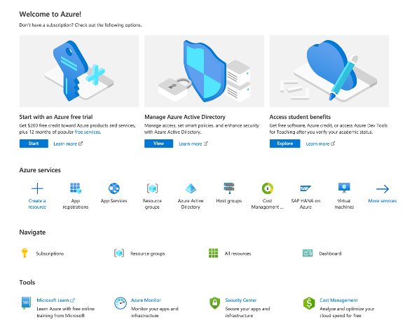

## Application Registration 
2. On the Azure portal welcome page, click [App Registrations] to start the App registration flow for our Microsoft Graph API application

   

3. Next, click the [+ New Registration] button

   

4. After clicking the button [Register] button below, you will be redirected to the overview page of our new application

   

   **Remark**
   - On this page the **Application (client) ID** and the **Directory (tenant) ID** are important.
   - The **Application (client) ID** will be used as **Client ID** in the SAP Cloud Platform Destination Configuration and the **Directory (tenant) ID** is part of the **Token Service URL**

   ```text
   -----------------------------------------------------------------------------------------------
   SAP Cloud Platform Destination Settings
   -----------------------------------------------------------------------------------------------
   Client ID         : <Application client ID of Azure App>
   Token Service URL : https://login.microsoftonline.com/<Directory Tenant ID of Azure App>/oauth2/v2.0/token
   ```

## Application Authentication 
5. Next, click [Authentication] in the left menu below Manage. The Application Authentication overview page shows up.

   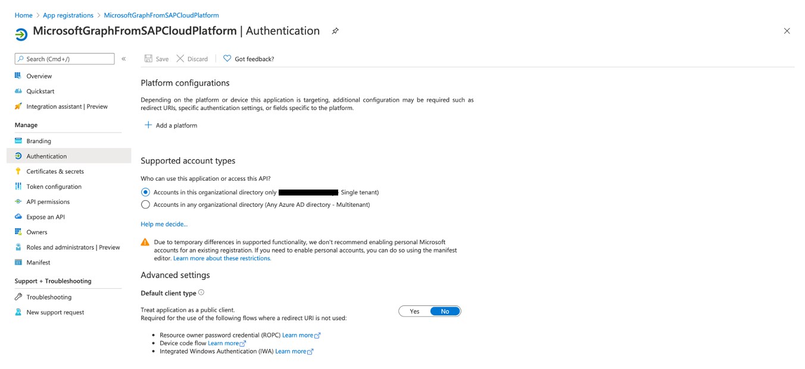

6. Click the [+ Add a Platform] button and choose [Web] tile under Web applications

   


7. Now we need to config the Web settings. We fill-in a dummy address for the Redirect URI and mark [v] the ID tokens under Implicit grant.

   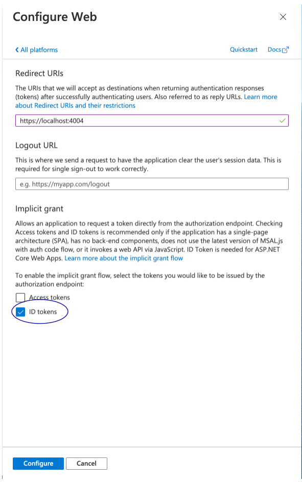

8. After clicking [Configure], you will be redirected back to the Application Authentication overview page adn the added Web platform and implicit grant setting will be showed.

   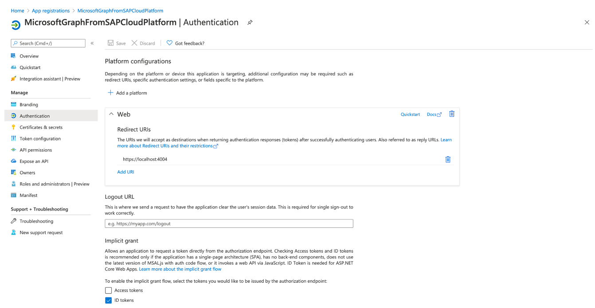

## Application Certificates and secrets
9. Next, click [Certificates and secrets] in the left menu below Manage. The Application Certificates and secrets overview page shows up.

   

10. Click the [+ New client secret] button, give it a name and choose the expiration time

    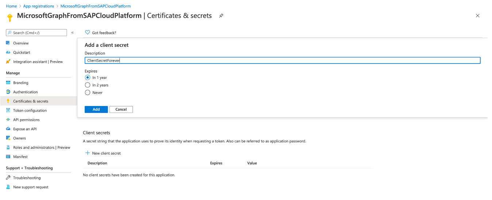

11. Click the [Add] button and new Client Secret value is showed.

    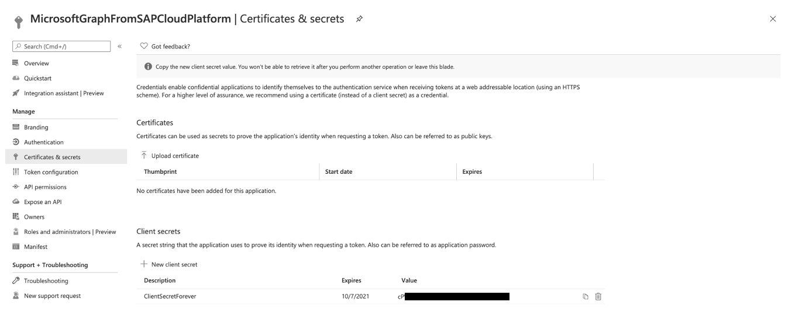

    **Remark**
    - Write down the Client Secret value on a safe place, because is the only moment this client secret value id showed
    - This client secret value is used as Client Secret in the SAP Cloud Platform Destination Settings 

    ```text
    -----------------------------------------------------------------------------------------------
    SAP Cloud Platform Destination Settings
    -----------------------------------------------------------------------------------------------
    Client Secret     : <Clients Secrets Value of Azure App>
    ```

## Application API permissions
12. Click [API permissions] button in the left menu below Manage. This shows an overview of the application API permissions.

    

13. Click on the [+ Add a permission] button to start the permission creation flow. Next, choose the Microsoft Graph tile.

    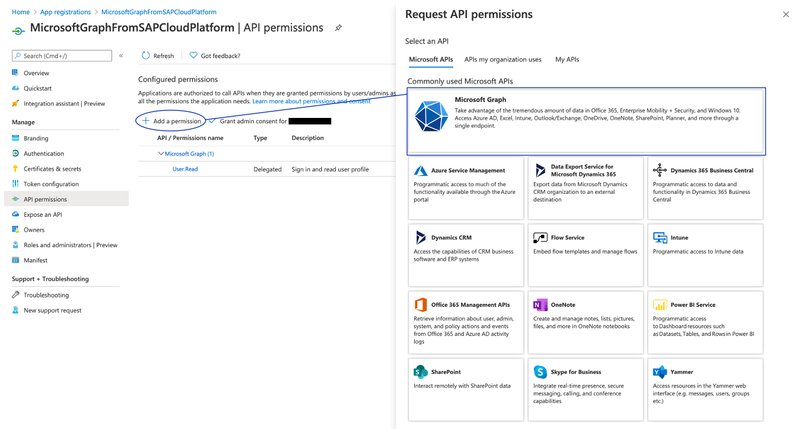

14. Next, click the [Application permissions] tile

    

15. Search for the needed permission and mark them; In our case we will search for the ***User.Read*** permissions and mark **User.Read.All**

    

16. After clicking [Add permissions], you will be redirect to the application API permissions overview page again and the new permissions are added to the list

    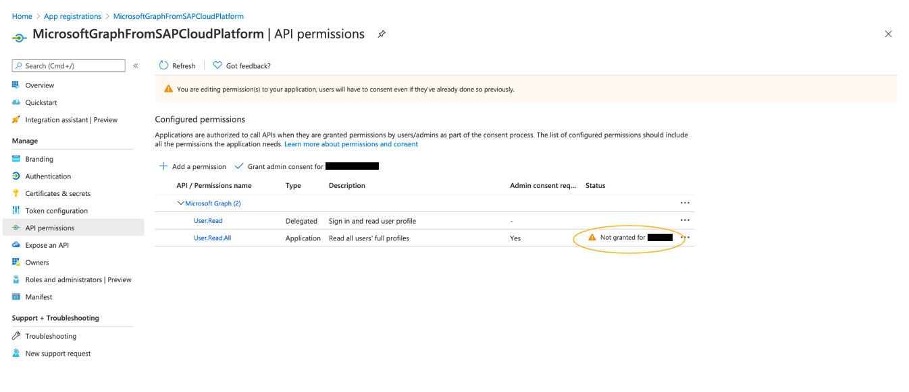

    **Remark**
    - A warning will be showed that the permissions aren't granted for your organization. 

17. We will fix this warning, clicking the [+ Add grant consent for your organisation] button. A popup will showed to confirm this grant consent

    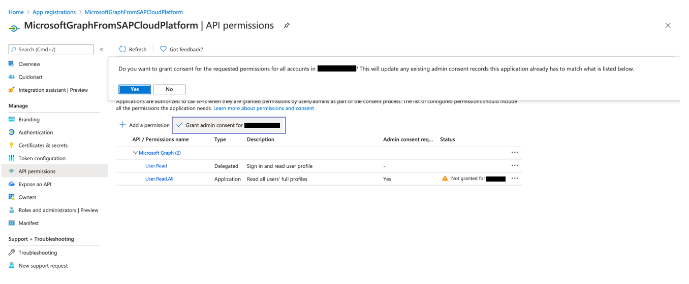

18. After clicking [Yes] the API permissions are successfully updated and the permissions are set for the API 

    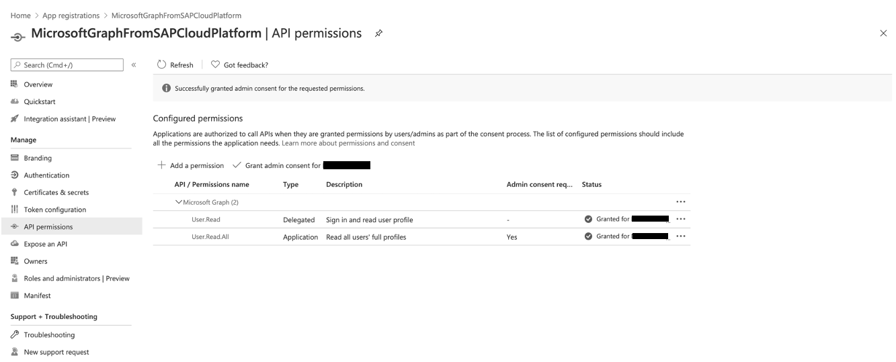

## Application API Endpoint
19. You are almost finished. You only need the endpoint of the Token Service URL. This can be found by clicking [Endpoint] on the Application Overview page and write down the value of the OAuth 2.0 token Endpoint(v2).

    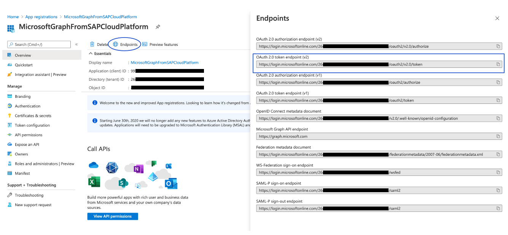

    ```text
    -----------------------------------------------------------------------------------------------
    SAP Cloud Platform Destination Settings
    -----------------------------------------------------------------------------------------------
    Token Service URL : <Application OAuth 2.0 token Endpoint(v2) of Azure App>
    ```

Now the configuration of Microsoft 365 settings is finished and a SAP Cloud Platform Destination for MSGraph can be configured.